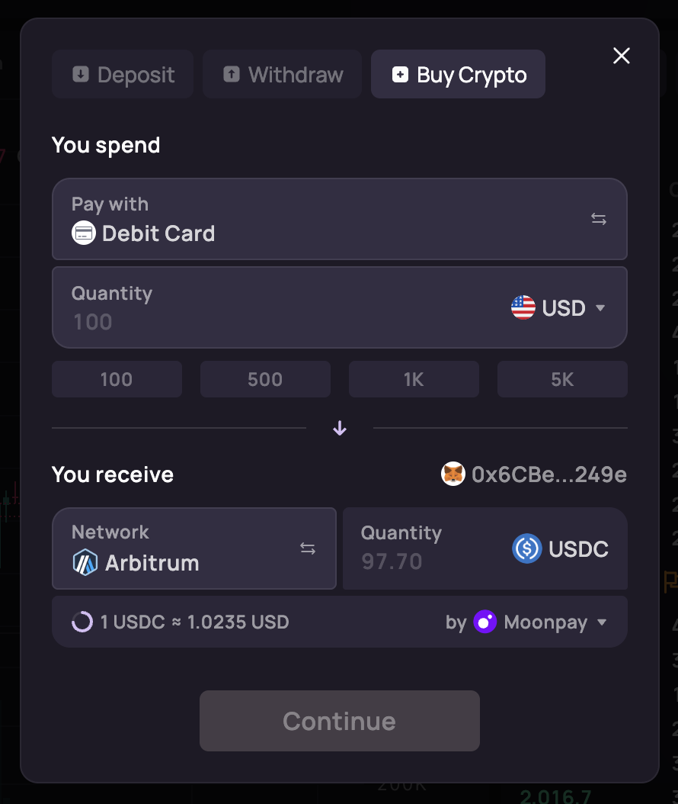
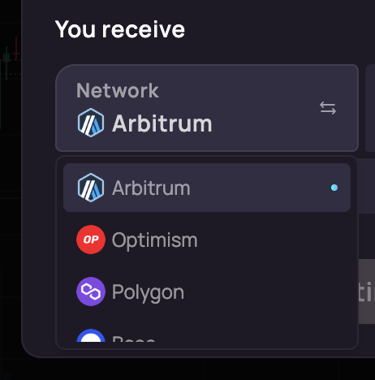
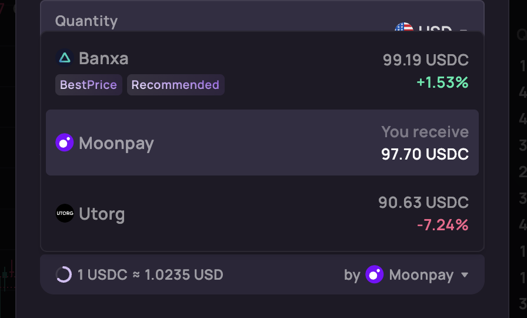
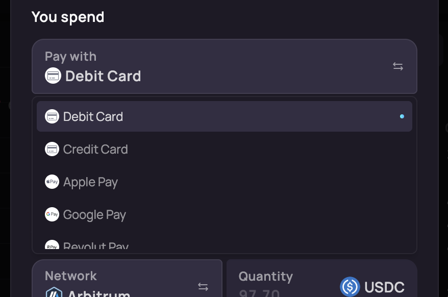
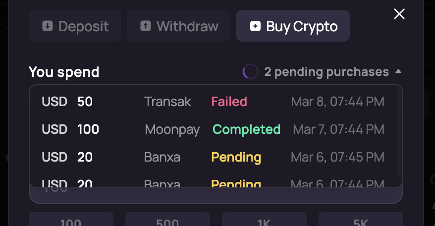

# @orderly.network/onramp-plugin

A fiat-to-crypto on-ramp plugin for the Orderly SDK. Adds a **"Buy Crypto"** tab to the Transfer dialog, allowing users to purchase USDC with fiat currencies through [Onramper](https://onramper.com).



## Features

### Fiat-to-Crypto Purchases

Buy USDC directly within the Orderly trading interface. Users enter a spend amount in fiat, choose a payment method and on-ramp provider, and complete the purchase through a secure embedded widget.

### Multi-Chain Support

Receive USDC on multiple networks including Ethereum, Arbitrum, Base, Optimism, Polygon, Avalanche, zkSync, Solana, BNB Chain, Linea, and more.



### Live Quotes & Provider Comparison

Real-time exchange rates from multiple on-ramp providers (Moonpay, Transak, Banxa, etc.), auto-refreshed every 30 seconds. Compare rates side-by-side and pick the best deal.



### Payment Methods

Supports multiple payment methods per provider — credit/debit cards, bank transfers, and more. Displays min/max spend limits for each method.



### Transaction History

Track on-ramp transaction status (pending, completed, failed) with automatic polling. Requires the optional Cloudflare Worker backend.



## Quick Start

### Installation

```bash
npm install @orderly.network/onramp-plugin
# or
pnpm add @orderly.network/onramp-plugin
# or
yarn add @orderly.network/onramp-plugin
```

### Register the Plugin

```tsx
import { registerOnrampPlugin } from "@orderly.network/onramp-plugin";
import "@orderly.network/onramp-plugin/dist/styles.css";

const plugins = [
  registerOnrampPlugin({
    apiKey: "YOUR_ONRAMPER_API_KEY",
    secretKey: "YOUR_ONRAMPER_SECRET_KEY",
    workerUrl: "https://your-worker.your-domain.workers.dev", // optional, enables transaction history
  }),
];
```

Then pass the plugins array to `OrderlyAppProvider`:

```tsx
<OrderlyAppProvider
  plugins={plugins}
  configStore={configStore}
  // ...other props
>
  {children}
</OrderlyAppProvider>
```

### Options

| Option | Type | Required | Description |
|--------|------|----------|-------------|
| `apiKey` | `string` | Yes | Onramper API key |
| `secretKey` | `string` | Yes | Onramper secret key for HMAC URL signing |
| `workerUrl` | `string` | No | Cloudflare Worker URL for transaction history |
| `title` | `string` | No | Tab title (default: `"Buy Crypto"`) |
| `icon` | `ReactNode` | No | Custom tab icon |

### Peer Dependencies

This plugin requires the following Orderly SDK packages:

- `@orderly.network/hooks`
- `@orderly.network/plugin-core`
- `@orderly.network/i18n`
- `@orderly.network/types`
- `@orderly.network/ui`
- `@orderly.network/utils`
- `react` >= 18
- `react-dom` >= 18

## Cloudflare Worker Setup (Optional)

A Cloudflare Worker is needed to receive Onramper webhooks and enable transaction history in the plugin. All setup is done through the [Cloudflare Dashboard](https://dash.cloudflare.com).

1. **Create a D1 Database** — Go to **Workers & Pages → D1 SQL Database**, create a new database. Open its console and run the SQL from [`cloudflare-worker/schema.sql`](cloudflare-worker/schema.sql) to create the table.

2. **Create the Worker** — Go to **Workers & Pages → Create Worker**. Replace the default script with the contents of [`cloudflare-worker/index.js`](cloudflare-worker/index.js).

3. **Bind the D1 Database** — In the Worker's **Settings → Bindings**, add a D1 Database binding with variable name `DB`, pointing to the database from step 1.

4. **Add the Webhook Secret** — In the Worker's **Settings → Variables and Secrets**, add an encrypted variable named `ONRAMPER_WEBHOOK_SECRET` with your webhook secret from the Onramper dashboard.

5. **Configure Onramper Webhook** — In the [Onramper Dashboard](https://dashboard.onramper.com), set your webhook URL to the deployed Worker URL.

6. **Use in Plugin** — Pass the Worker URL as `workerUrl` when registering the plugin.
